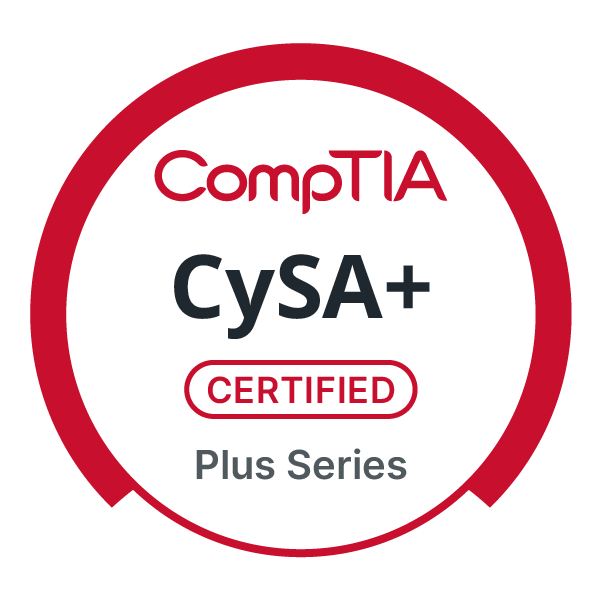

# CySA+ Reference Dossier — Interactive Study Guide




<p align="center">
  
  
  
  
</p>

---

## 📚 About

**CySA+ Reference Dossier** is an interactive, browser-based study guide for the **CompTIA CySA+ CS0-003** certification exam. This comprehensive reference tool covers all four domains with detailed definitions, contextual examples, and expandable explanations for over 130 security analytics and response terms.

Designed with a tactical "security analyst workstation" aesthetic, this tool helps SOC analysts, threat hunters, and exam candidates master essential concepts through an intuitive, searchable interface. Each term includes a concise definition, a practical example, and an expandable section with deeper explanations.

---

## 🎯 Domains Covered

| Domain       | Title                                   | Exam Weight | Focus Area                                                                 |
| ------------ | --------------------------------------- | ----------- | --------------------------------------------------------------------------- |
| **01** | Security Operations                     | 33%         | Threat intelligence, monitoring, EDR, SIEM, cloud security, automation      |
| **02** | Vulnerability Management                | 30%         | Scanning, analysis, prioritization, remediation, reporting                  |
| **03** | Incident Response and Management        | 23%         | IR lifecycle, forensic analysis, containment, communication, lessons learned |
| **04** | Reporting and Communication             | 14%         | Metrics, KPIs, compliance reporting, stakeholder communication, governance  |

---

## ✨ Key Features

### 🔍 **Smart Search & Filtering**
- **Real-time search** across term names, definitions, and examples.
- **Domain filtering** — view terms from specific CySA+ domains.
- **Keyboard shortcuts**: `/` to focus search, `Esc` to clear filters.
- **Live statistics** showing visible terms and per-domain counts.

### 📖 **Expandable Term Cards**
- Click any term row to expand and view:
  - **Full definition** with detailed explanation.
  - **Contextual example** showing real-world application (incident scenarios, threat hunting, etc.).
- Expand/collapse sections for focused study sessions.

### 🎨 **Tactical Analyst Design**
- Dark "SOC workstation" aesthetic with neon cyan accents.
- Color-coded domain sections (Cyan, Amber, Blue, Magenta).
- Monospace and terminal-inspired typography.
- Subtle scan-line overlay and grid background.

### 📊 **Term Coverage by Domain**

| Domain       | Key Topics Covered                                                                                                                                                                                           |
| ------------ | ------------------------------------------------------------------------------------------------------------------------------------------------------------------------------------------------------------ |
| **D1** | Threat intelligence (OSINT, closed-source), EDR, NGFW, CASB, DLP, PKI, MFA, SSO, federation, IoCs, threat hunting, UEBA, SOAR, cloud security (CASB/SASE)                                                   |
| **D2** | Active/agent/agentless scanning, CVSS, CVE, vulnerability prioritization, attack surface management, OWASP Top 10 (injection, XSS, broken access control), adversary emulation, bug bounties                |
| **D3** | Incident Response lifecycle (NIST), cyber kill chain, MITRE ATT&CK, diamond model, chain of custody, forensic investigation, tabletop exercises, root cause analysis, playbooks                              |
| **D4** | Compliance reporting (GDPR, PCI DSS), KPIs and metrics, SLA/MOU, compensating controls, business process interruption, legacy systems, organizational governance, patching strategies                        |

---

## 🛠️ Technical Implementation

### Tech Stack

| Technology             | Purpose                                                                   |
| ---------------------- | ------------------------------------------------------------------------- |
| **HTML5**        | Semantic document structure with nested sections                         |
| **CSS3**         | Custom properties, grid/flexbox, neon animations, responsive design      |
| **JavaScript**   | Dynamic search, domain filtering, expand/collapse interactions            |
| **Google Fonts** | Orbitron (display), Share Tech Mono (terminal), Rajdhani (body)           |

### Interactive Features

| Feature                      | Implementation                                  |
| ---------------------------- | ----------------------------------------------- |
| **Search**             | Real-time filtering with live term counter      |
| **Domain Filter**      | 5 filter buttons (All + 4 domains)              |
| **Expandable Rows**    | Click any term to expand/collapse details       |
| **Keyboard Shortcuts** | `/` = focus search, `Esc` = clear and reset     |
| **Live Counters**      | Dynamic term counts update with each filter     |

---

## 🎮 Usage Guide

### Navigation
1. **Filter by Domain** — Use the color-coded buttons to focus on Security Operations, Vulnerability Management, Incident Response, or Reporting.
2. **Search Terms** — Type in the search box to find terms by name, acronym, definition, or example context.
3. **Expand Terms** — Click any term row to reveal the full definition and a practical example.
4. **Clear Filters** — Press `Esc` to reset search and show all terms.

### Keyboard Shortcuts
| Key               | Action                         |
| ----------------- | ------------------------------ |
| **`/`**   | Focus search input             |
| **`Esc`** | Clear search and reset filters |
| **Click**   | Expand/collapse term details   |

### Study Tips
1. **Start with Domain 1 (Security Operations)** — Build your SOC vocabulary.
2. **Use the search like an analyst** — Look for specific tools (EDR, SIEM, CASB) or attack techniques (MITRE ATT&CK).
3. **Expand and contextualize** — Read the examples to see how concepts apply during real incidents.
4. **Focus on weak domains** — Filter by domains where you need the most review.
5. **Practice recall** — Cover the definition and try to explain the term before expanding.

---

## 📋 Term Examples

### Security Operations (Domain 01)
| Term                 | Definition                          | Example                             |
| -------------------- | ----------------------------------- | ----------------------------------- |
| **Threat Hunting** | Proactive search for threats using hypothesis-driven analysis | Analyst uses EDR telemetry to hunt for living-off-the-land binaries |
| **SOAR**       | Orchestration and automation of incident response workflows | Playbook auto-contains a compromised endpoint and opens a ticket |

### Vulnerability Management (Domain 02)
| Vulnerability                | Description                         | Mitigation                         |
| ------------------------- | ---------------------------------- | ------------------------------- |
| **SQL Injection**    | Malicious SQL queries through input fields | Parameterized queries + WAF                    |
| **Cross-Site Scripting (XSS)** | Injecting scripts into trusted websites | Output encoding + Content Security Policy |

---

## 🚀 Future Enhancements

- [ ] Add "Flashcard Mode" for active recall and spaced repetition.
- [ ] Include practice quiz questions with scenario-based prompts.
- [ ] Bookmarking system for high-priority terms.
- [ ] Dark/Light theme toggle (preserving the analyst vibe).
- [ ] Export notes to PDF or Markdown.
- [ ] Link to MITRE ATT&CK mappings for each attack-related term.
- [ ] Progress tracking with localStorage (save last studied domain).

---

## 📁 Project Structure

```
CySA-Plus-Reference-Dossier/
├── index.html          # Complete single-page application
├── README.md           # Project documentation (this file)
└── assets/             # (Optional) screenshots, icons
```

---

## 📝 License

MIT License — See LICENSE file for details.

---

## 🙏🏿 Acknowledgements

- **CompTIA** — CySA+ CS0-003 exam objectives and glossary.
- **MITRE Corporation** — ATT&CK framework and adversary tactics.
- **NIST** — Incident response guidelines and vulnerability management standards.
- **OWASP** — Web application security risks and testing guides.

---

## 📧 Contact & Demo

- **Live Demo**: [View CySA+ Reference Dossier](https://willie-conway.github.io/CySA-Plus-Reference-Dossier/) *(Update with your actual GitHub Pages link)*
- **GitHub Repository**: [Report issues or contribute](https://github.com/Willie-Conway/CySA-Plus-Reference-Dossier)

---

<p align="center">
  <strong>🛡️ CySA+ Reference Dossier — Complete CS0-003 Exam Preparation 🛡️</strong><br />
  <em>All 4 Domains · 130+ Terms · Interactive SOC Analyst Study Guide</em>
</p>

---

*Last updated: May 2026*

